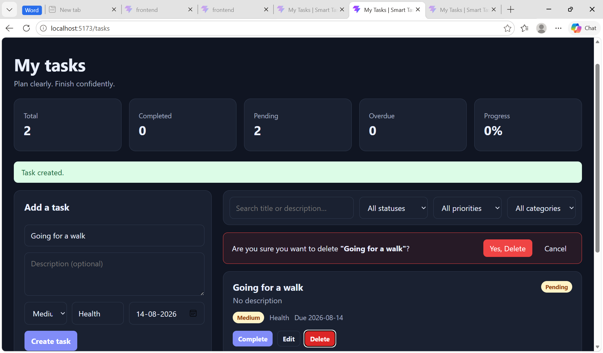

# Smart Task (Task Management System)

## Project Overview

The Smart Task is a full-stack task management application designed to help users efficiently organize, track, and manage their daily tasks. It provides secure user authentication, private task management, task filtering, dashboard analytics, due-date tracking, and AI-based task suggestions. 

## Features

-   **Authentication:** Secure JWT-based registration and login 
-   **Task Management:** Create, edit, complete, and delete tasks.
-   **Priority & Categories:** Set task priority and categories
-   **Search & Filter Tasks:** Search and filter tasks easily.
-   **Due Dates:** Track deadlines and overdue tasks.
-   **AI Suggestions:** Get task ideas based on your goals.
-   **Theme Support:** Responsive light and dark mode.

------------------------------------------------------------------------

## Technologies Used

- **Frontend:** React, Vite, JavaScript
- **Backend:** Python, FastAPI
- **Database:** PostgreSQL
- **Authentication:** JWT(JSON Web Tokens)

------------------------------------------------------------------------
## Architecture
flowchart LR
    U["User"] --> F["React + Vite Frontend"]

    F -->|HTTP REST + JWT| B["FastAPI Backend"]

    B --> A["Authentication"]
    B --> T["Task Service"]
    B --> AI["AI Suggestion Service"]

    A --> DB["SQLAlchemy"]
    T --> DB

    DB --> N["Neon PostgreSQL"]


## Project Structure

``` text
SmartTaskManagementSystem/
├── backend/
│   ├── app/
│   │   ├── core/
│   │   ├── routers/
│   │   ├── services/
│   │   ├── main.py
│   │   ├── database.py
│   │   ├── models.py
│   │   ├── schemas.py
│   │   └── dependencies.py
│   ├── requirements.txt
│   ├── .env
│
├── frontend/
│   ├── src/
│   │   ├── api/
│   │   │   └── client.js
│   │   ├── components/
│   │   │   ├── AiSuggestions.jsx
│   │   │   ├── Dashboard.jsx
│   │   │   ├── Navbar.jsx
│   │   │   ├── TaskCard.jsx
│   │   │   ├── TaskFilters.jsx
│   │   │   ├── TaskForm.jsx
│   │   │   └── TaskList.jsx
│   │   ├── context/
│   │   │   ├── AuthContext.jsx
│   │   │   └── ThemeContext.jsx
│   │   ├── pages/
│   │   │   ├── LoginPage.jsx
│   │   │   ├── RegisterPage.jsx
│   │   │   └── TasksPage.jsx
│   │   ├── App.jsx
│   │   ├── main.jsx
│   │   └── styles.css
│   ├── package.json
│   └── vite.config.js
│
└── .gitignore
└── README.md
```

------------------------------------------------------------------------

## Installation

### Prerequisites

-   Python 3.10+
-   Node.js 18+
-   Git

### Frontend

``` bash
cd frontend
npm install
```

### Backend

``` bash
cd backend
python -m venv .venv

```

Activate the virtual environment and install dependencies:

``` bash
pip install -r requirements.txt
```


## How to Run

To start the backend server, run:

``` bash
.venv\Scripts\activate.bat
uvicorn app.main:app --reload
```

To start the frontend server, run:

``` bash
cd frontend
npm run dev
```
------------------------------------------------------------------------

## Screenshots




